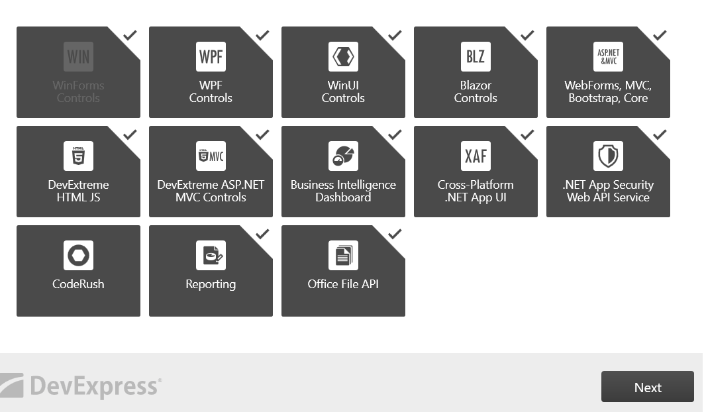
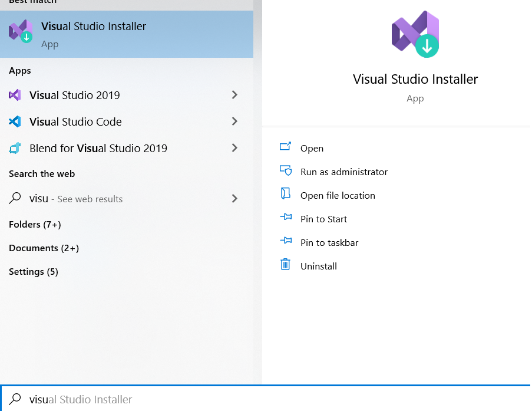
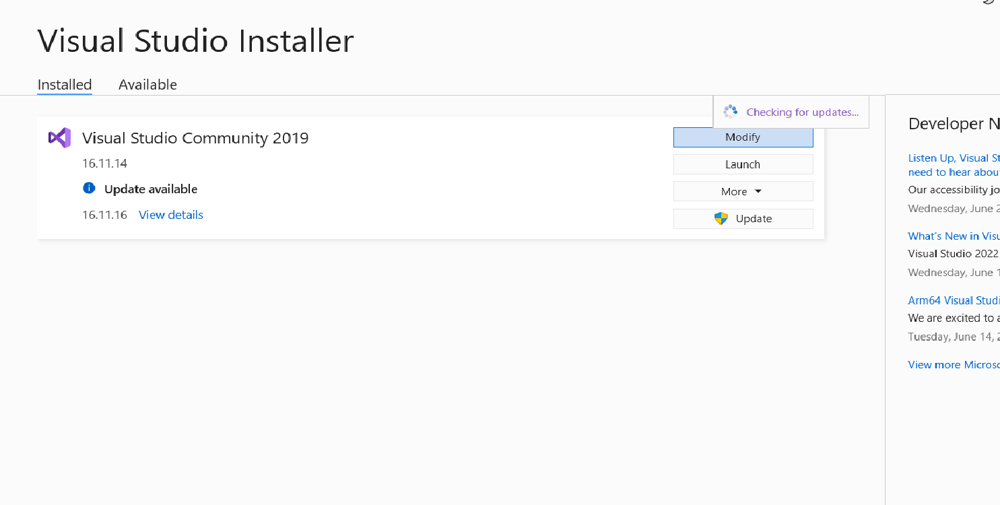
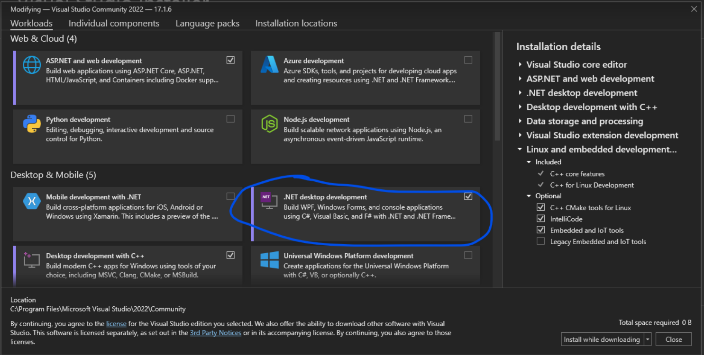
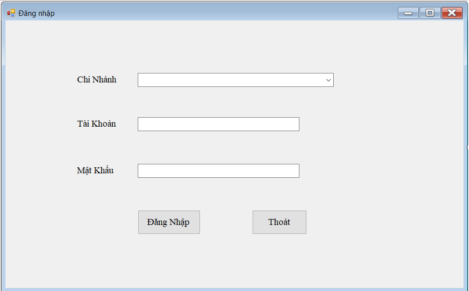
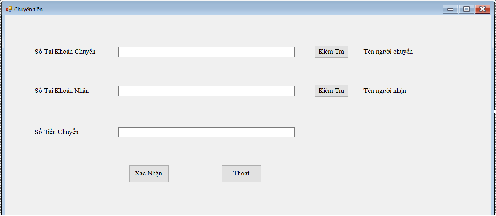
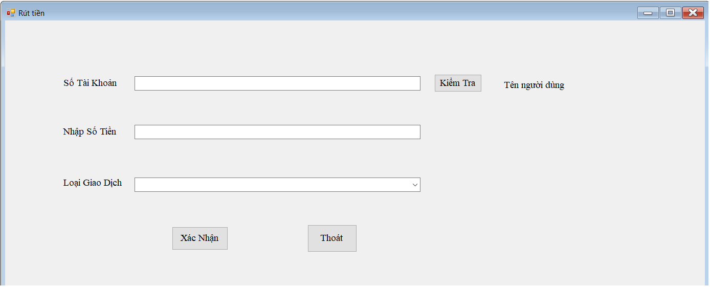

# CSDLPT_NGANHANG

## Explain the project:

- Distributed database final project of teacher Luu Nguyen Ky Thu.
- using visual studio software 2019
- using C# language

## Features:

- create customer account
- create an employee account
- withdraw money, deposit money
- create, delete, update employee
- create, delete, update customer
- form login, logout
- decentralization

## Installation:

Open CMD and run [this](https://github.com/hanamthai/CSDLPT_NGANHANG.git) code.
```bash
https://github.com/hanamthai/CSDLPT_NGANHANG.git
```

## Usage:

### Download DevExpress:
  ```bash
  https://drive.google.com/file/d/12bLKSbfklrvRY6NpCprJdHTdlipatwhm/view?usp=sharing
  ```
  
  
### Download package "Windown Form":
- Search Visual Studio Installer

- Then you select "modify"



You just need to clone the project to your local computer and open it with visual studio.

## Demo:




### Note:

```diff
- You need to create SP on main server in sql server and push them down to fragmented sites.
- I have saved the SP in the file stored_procedure.txt
- The project part only accounts for 40% of the total score, the remaining 60% is theory, so you need to learn the theory well.
- I have saved the theory part at cauhoi.txt, all the questions that Mr. Luu Nguyen Ky Thu are there.
- Try your best.
```

## Contributer:

Thanks to Duykhanhrk for supporting me in this project.
